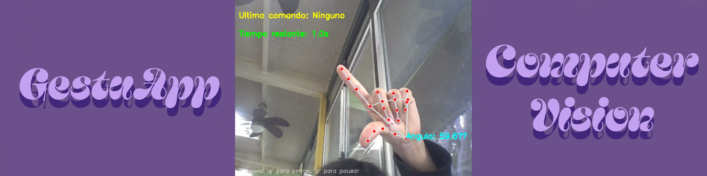
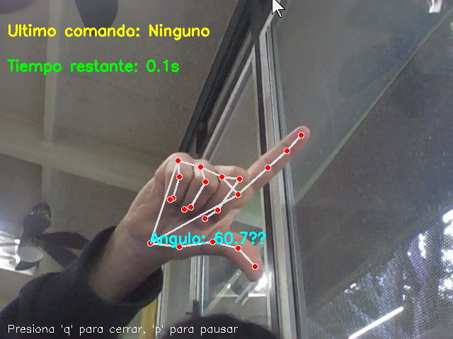
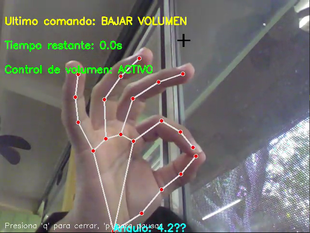
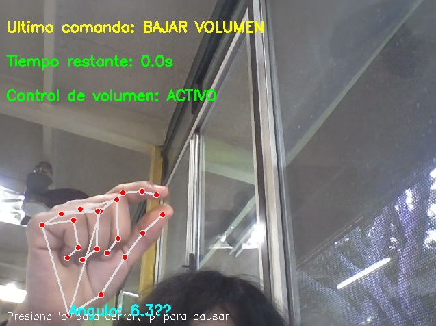
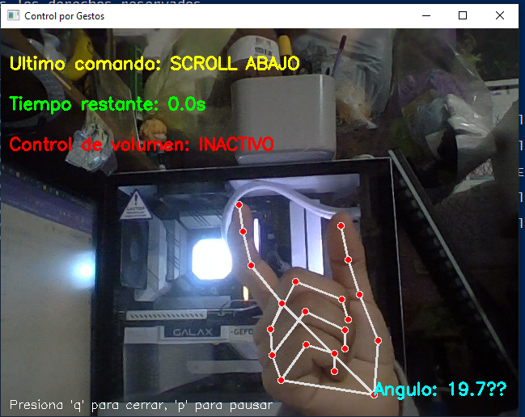
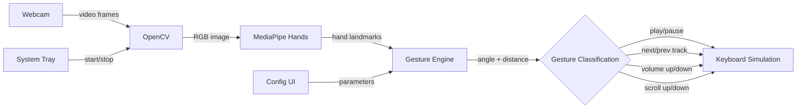
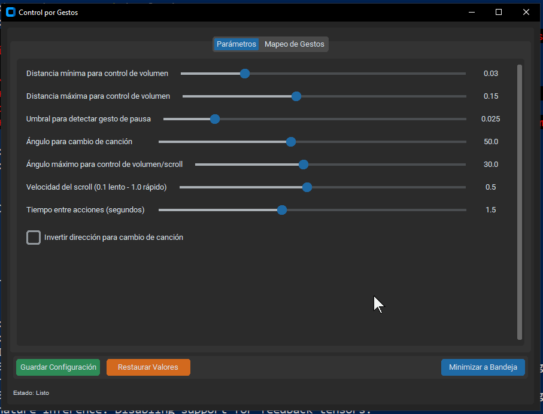
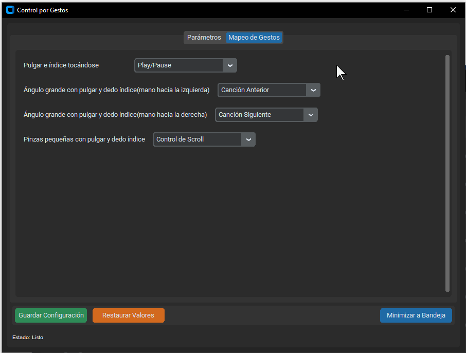

<p align="center">
  
</p>

<h1 align="center">GestuApp</h1>

<p align="center">
  <b>Control your media and scroll with hand gestures using your webcam</b>
</p>

<p align="center">
  
  
  
  
</p>

---

## What is GestuApp?

GestuApp is a desktop application that lets you **control your computer with hand gestures** detected in real time through your webcam. Using MediaPipe for hand tracking and OpenCV for video processing, it recognizes specific finger positions and movements to trigger media actions — play/pause music, skip tracks, adjust volume, or scroll through pages — all without touching your keyboard.

It runs quietly in your system tray and comes with a modern configuration UI built with CustomTkinter, where you can fine-tune every parameter and remap gestures to different actions.

<p align="center">
  <table>
    <tr>
        <td></td>
        <td></td>
    </tr>
    <tr>
      <td></td>
      <td></td>
    </tr>
  </table>
</p>


---

## Features

- **Hand gesture recognition** — Real-time hand tracking using MediaPipe with angle and distance-based gesture detection
- **Media control** — Play/pause, next track, and previous track via configurable hand gestures
- **Volume control** — Adjust system volume by pinching your thumb and index finger closer or further apart
- **Scroll control** — Scroll pages up and down with adjustable speed using finger position
- **Modern config UI** — CustomTkinter interface with tabs for parameter tuning and gesture remapping
- **System tray integration** — Runs in the background; left-click the tray icon to toggle the camera window
- **Fully configurable** — Adjust distance thresholds, angle thresholds, cooldown times, scroll speed, and invert directions
- **Gesture remapping** — Assign any available action to any detected gesture from the UI
- **Persistent settings** — Configuration is saved to a JSON file and survives restarts
- **Anti-bounce system** — Configurable cooldown between actions to prevent accidental repeated triggers

---

## How It Works



1. The **webcam** captures video frames in real time via OpenCV
2. Each frame is converted to RGB and sent to **MediaPipe Hands** for landmark detection
3. The **gesture engine** calculates the angle between thumb, wrist, and index finger, plus the distance between thumb and index fingertips
4. Based on configurable **thresholds**, the gesture is classified into one of the available actions
5. The corresponding **keyboard shortcut** is simulated (media keys, volume keys, or page up/down)
6. An **anti-bounce timer** prevents repeated triggers within the configured cooldown period

---

## Gestures

| Gesture | Default Action | How to Perform |
|---|---|---|
| **Thumb + index touching** | Play / Pause | Bring your thumb and index fingertips together |
| **Wide angle, hand left** | Previous track | Open your thumb and index finger wide, pointing left |
| **Wide angle, hand right** | Next track | Open your thumb and index finger wide, pointing right |
| **Pinch** | Volume control | Make a pinch and change its size (distance between thumb and index) — closer to lower, further to raise |
| **Pinch (U shape)** | Scroll down | Form a U-shaped pinch with thumb and index to scroll down |
| **Pinch (C shape)** | Scroll up | Form a C-shaped pinch with thumb and index to scroll up |

> All gesture-to-action mappings can be changed from the **Gesture Mapping** tab in the configuration window.

---

## Getting Started

### Prerequisites

- **Python 3.10+**
- A working **webcam**
- **Windows 10/11** (tested on Windows 10) — may work on other platforms with minor adjustments

### Installation

1. **Clone the repository**

```bash
git clone https://github.com/pepinisillo/GestuApp.git
cd GestuApp
```

2. **Install dependencies**

```bash
pip install -r requirements.txt
```

3. **Run the application**

```bash
python gestuapp.py
```

> **Note:** On Linux, the `keyboard` library requires root privileges. Run with `sudo` if needed, or configure udev rules for your user.

### First Launch

When you run GestuApp for the first time:

1. The camera window opens automatically showing the live feed with hand tracking overlay
2. A **system tray icon** appears — right-click it to access options
3. The configuration window is hidden by default — right-click the tray icon and select **Show/Hide Config**

---

## Configuration

### Parameters Tab



| Parameter | Description | Default |
|---|---|---|
| **Min volume distance** | Minimum finger distance for volume control | 0.05 |
| **Max volume distance** | Maximum finger distance for volume control | 0.15 |
| **Pause threshold** | Distance threshold to detect the touch gesture | 0.025 |
| **Song change angle** | Minimum angle to trigger track change | 50° |
| **Volume/scroll angle** | Maximum angle for volume/scroll mode | 30° |
| **Scroll speed** | Speed of page scrolling (0.1 slow — 1.0 fast) | 0.5 |
| **Action cooldown** | Minimum time between consecutive actions | 1.5s |
| **Invert track direction** | Swap left/right for next/previous track | Off |

### Gesture Mapping Tab




Each detected gesture can be remapped to any of the following actions:

- Play/Pause
- Previous Track
- Next Track
- Volume Control
- Scroll Control
- Do Nothing

---

## Keyboard Shortcuts (Camera Window)

| Key | Action |
|---|---|
| `q` | Hide camera window (minimizes to tray) |
| `p` | Pause / resume gesture detection |

---

## Project Structure

```
GestuApp/
├── gestuapp.py        # Main application (gesture engine + UI + tray)
├── requirements.txt   # Python dependencies
├── images/            # UI and gesture screenshots for documentation
│   ├── banneer.png
│   ├── gesto1.png
│   ├── gesto2.png
│   ├── gesto3.png
│   ├── gesto4.png
│   ├── parameters.png
│   └── mapping_gesture.png
├── .gitignore
└── README.md
```

---

## Tech Stack

<p align="center">
  
  
  
  
  
  
</p>

---

<p align="center">
  
  <i>"If you smile everyday and live happily from now on, then that's enough"</i><br/>
  <b>— Yuuichirou Hyakuya</b>
</p>
